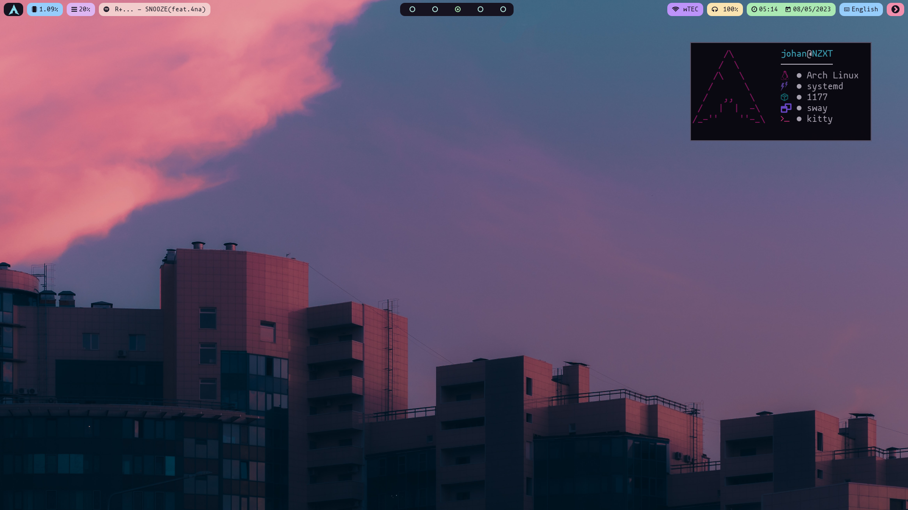
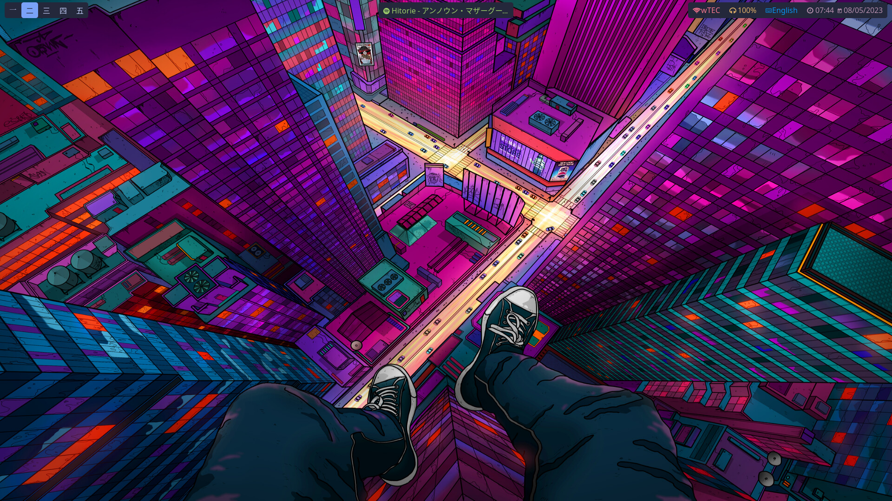

    <h1 align="center">Welcome to my dotfiles!</h1>

Here you'll find a collection of configuration files 
that I use to customize my development environment. 
These dotfiles include settings for my shell, text 
editor, and other tools that I use on a daily basis.

---

## [Catppuccin](./catppuccin/README.md)

<!-- ## [Tokyo Night](./tokyo-night/README.md) -->
<!--  -->
