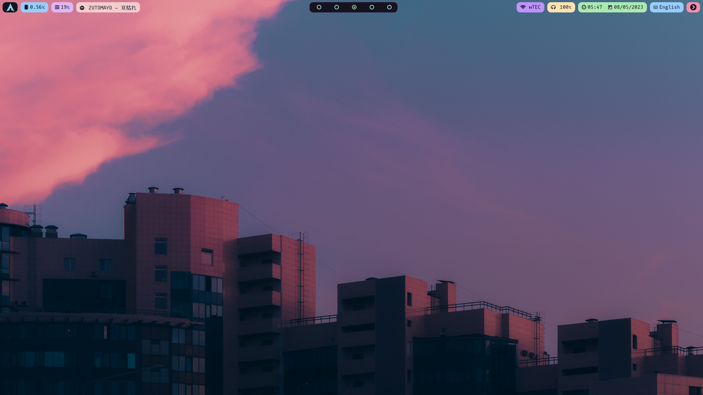
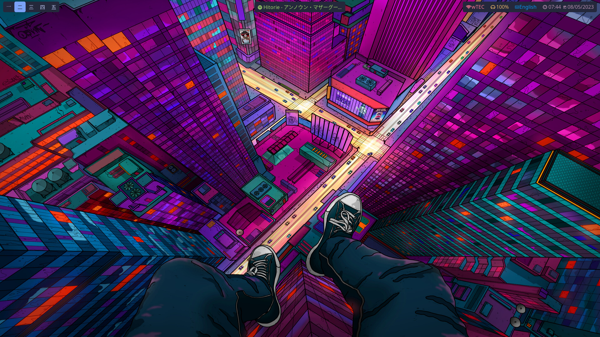
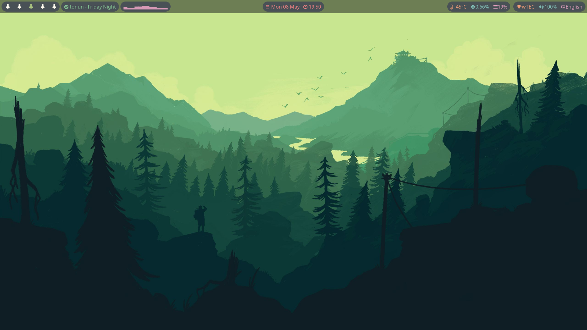
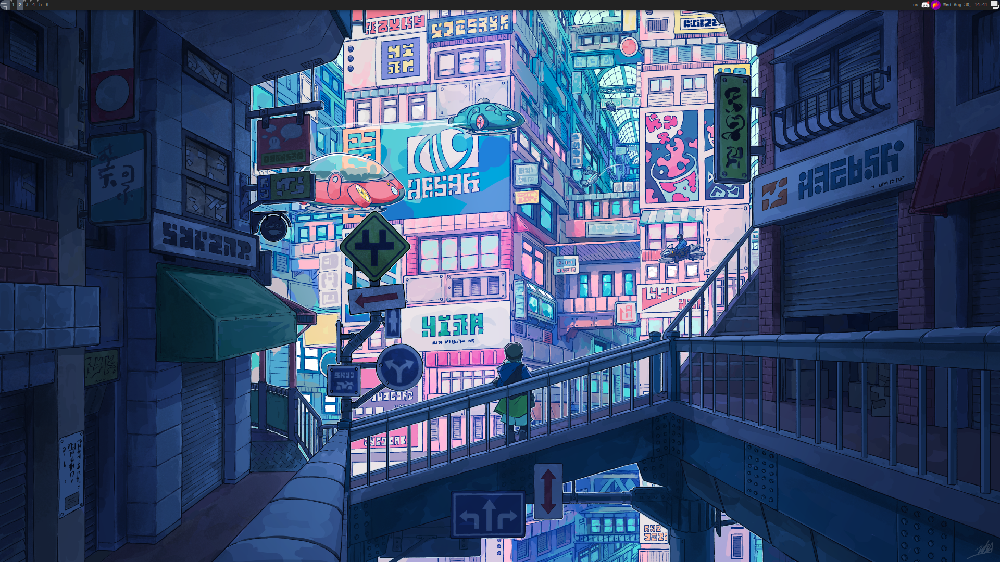

    <h1 align="center">Welcome to my dotfiles!</h1>

Here you'll find a collection of configuration files 
that I use to customize my development environment. 
These dotfiles include settings for my shell, text 
editor, and other tools that I use on a daily basis.

--

    
🌸 Wayland

    

## [Catppuccin - Sway](./wayland/catppuccin/README.md)

## [Tokyo Night - Sway](./wayland/tokyo-night/README.md)

## [Everforest - Sway](./wayland/everforest/README.md)

    

    
🍁 Xorg

    

## [Techno City - Awesome](./xorg/techno-city/README.md)

    

--

## Usage

Each desktop config has their own files, settings and `README.md`, nevertheless
there is a folder `global` that contains scripts and utils that I use in some
configs.
