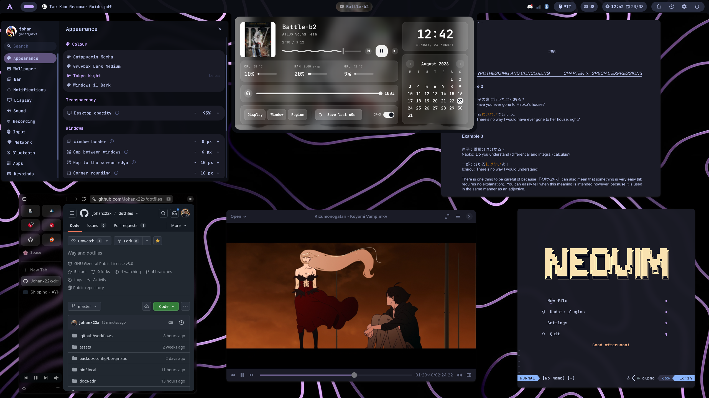
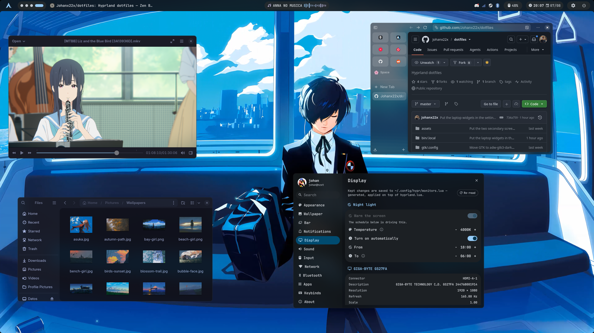

<div align="center">

# dotfiles

**Arch Linux · Hyprland or niri · Quickshell**

The accent palette is generated from the wallpaper.

<br>




<sub>Two wallpapers, one desktop. Every accent above comes from the image behind it.</sub>

<br>
<br>

| | |
|---|---|
| **Compositor** | Hyprland in Lua, or niri in KDL — same keybinds either way |
| **Shell** | Quickshell — bar, island, launcher, notifications, settings |
| **Terminal** | kitty · zsh · starship |
| **Editor** | Neovim |
| **Browser** | Zen |
| **Files** | Nautilus · ranger |
| **Media** | Celluloid · Loupe · zathura |
| **Color** | matugen |
| **Session** | SDDM · GRUB · btrfs snapshots with snapper |

</div>

---

## Requirements

Arch Linux or an Arch-based distribution, `git`, a user with `sudo`, and a
network connection. Everything else the installer offers to fetch. Enable
`[multilib]` in `/etc/pacman.conf` first if you want the Steam packages.

## Install

```sh
git clone https://github.com/Johanx22x/dotfiles.git ~/dotfiles
cd ~/dotfiles && ./install.sh
```

It opens by asking which compositor this machine gets — Hyprland, niri, or both
— because that decides what gets installed and what gets linked. A bare Enter
takes Hyprland, which is the default and the one everything here was built
against. See [Compositors](#compositors) below.

Then seven steps, each asking before it acts:

| | |
|---|---|
| **1 · Packages** | `packages/pacman.txt` and the chosen compositor's list, plus `packages/multilib.txt` if multilib is on |
| **2 · AUR** | builds `yay` if missing, then `packages/aur.txt` |
| **3 · Symlinks** | `stow` links the config into `$HOME` |
| **4 · Seeds** | copies `seeds/` where nothing exists yet — never overwrites |
| **5 · Neovim** | clones [Johanx22x/nvim](https://github.com/Johanx22x/nvim) into `~/.config/nvim` |
| **6 · Cursors** | downloads the Material Bibata pack into `~/.icons` so the pointer can follow the wallpaper |
| **7 · Palette** | a first `wallpaper-switch random` so the generated colour files exist |

It refuses to run as root or off Arch, and skips a package it cannot find
instead of aborting the transaction. If files are already in the way, it lists
them and offers to move them to `~/dotfiles-replaced-<timestamp>` — it never
deletes and never adopts.

Then it asks whether this is a laptop (battery and brightness widgets, off by
default) and prints every attached monitor with the command that records it.

**Left to you:** the GPU driver, `/etc`, `chsh -s /usr/bin/zsh`, and the
monitors if the check listed one as unconfigured.

## Updating

```sh
cd ~/dotfiles && git pull
```

The config lives in `$HOME` as symlinks back into this repo, so a pull is
already live for every file that was linked before. Re-run `./install.sh` when a
release adds new files or packages — it is idempotent, and steps you do not want
can be answered no.

Nothing running picks the changes up on its own:

```sh
hyprctl reload                                        # Hyprland
                                                      # niri reloads on save
qs kill && qs -d -p ~/.config/quickshell/shell.qml    # Quickshell
```

`~/.config/nvim` is a separate repository and updates on its own.

## Compositors

Two flavors, chosen at install time and switched at the display manager. They
are not exclusive: answer **both** and each session appears separately in SDDM,
so one can be tried without dismantling the other.

Built and tested against **Hyprland 0.56** and **niri 26.04**. Where a version
matters — and it does more than once, because both move fast — the config says
so next to the line that depends on it.

| | Hyprland | niri |
|---|---|---|
| Model | dynamic tiling (dwindle) | scrollable tiling (columns) |
| Config | `hypr/` — Lua, `hyprctl reload` | `niri/` — KDL, reloads on save |
| Packages | `packages/hyprland.txt` | `packages/niri.txt` |
| Session | `uwsm` | `niri-session` |
| Portal | `xdg-desktop-portal-hyprland` | `xdg-desktop-portal-gnome` |

| Workspaces | numbered, permanent | dynamic, renumbered as they empty |
| Blur | global, behind anything translucent | per window, asked for by a rule |
| Blue light | `hyprsunset` | `wl-gammarelay-rs` |

**Every keybind is the same in both.** Four Hyprland actions have no niri
equivalent, and rather than leave those chords dead each went to the nearest
thing niri actually does: pseudotile cycles the preset column widths,
togglesplit stacks the column as tabs, pin jumps between the floating and tiled
layers, and the magic scratchpad — niri has none, and faking one cost a
permanent workspace — became "back to the previous workspace".

What niri can do and Hyprland cannot is bound on chords that were free: the
overview on `SUPER + Tab`, moving and consuming columns, the ends of the strip,
monitor focus. Every one of those decisions is written next to the bind it
belongs to in `niri/.config/niri/config.kdl`.

**Workspaces behave differently and that is not configurable.** niri creates
them as you need them and renumbers when one empties, so `SUPER + 3` is the
third workspace *at that moment*. Ten named, permanent ones were built to fix
that and then taken out again: named workspaces exist whether or not anything is
on them, so the overview always showed ten slots with nine empty. The bar can
filter empties; the compositor's overview cannot. Stable numbers or an honest
overview — there is no third option, and the trade-off is written into the
config.

### Adding a third one

The shell never asks which compositor is running. It asks what the running one
**can do**, and draws accordingly — so a compositor that cannot report window
counts, or has no way to grab focus, is a supported case rather than a broken
one.

```
quickshell/Compositor.qml       the facade — the only file that knows there is
                                more than one
  compositor/
    CompositorBackend.qml       the contract: every property has an empty
                                default, every capability defaults to false
    HyprlandBackend.qml
    NiriBackend.qml
bin/compositor                  the same idea for shell scripts:
                                `compositor is niri`, `compositor can gamma`
```

A new backend is one file, one `Component` and one `case` in the detector.
Nothing else changes, because every consumer already handles the "cannot"
path — niri exercises it today. **An unknown compositor is supported too:** with
no match the plain contract loads, so the bar, clock, tray and notifications
come up while the compositor-dependent parts stay away, and the settings pages
that need one are not offered at all.

Anything answerable through a protocol everyone speaks lives in the base rather
than in a backend — fullscreen detection goes through
`wlr-foreign-toplevel`, and logout falls back to logind — so a new compositor
gets those for free.

**Settings reach both flavors through one script.** `desktop-tweak` — the old
`hypr-tweak`, renamed once it stopped being about one compositor — keeps a
single state file and writes an override layer per flavor: `tweaks.lua` for
Hyprland, `tweaks.kdl` for niri, both gitignored and both read last by their
config. Applying differs and nothing else does: Hyprland is told with `hyprctl
eval`, while niri watches the files it includes, so writing one is what applies
it.

`desktop-monitors` — the old `hypr-monitor` — does the same for the display page:
it lists what is connected in one shape whichever compositor answered, applies a
provisional change, and writes the confirmed one into `monitors.lua` or
`monitors.kdl`. The one thing that is **not** symmetric is what that file is.
Under Hyprland it is an override layer on top of the monitor block in
`hyprland.lua`; under niri it is the only declaration of any output there is,
because an `output` block in an included file is ignored when the including file
names the same monitor. So `config.kdl` declares none and includes the generated
file first — and the display page's *Copy config* chip, which hands you a block
to paste into the tracked config, is not offered there: pasting one in would
shadow the generated file for good.

### What niri cannot do

Not a to-do list — these were each tried, measured and written down:

| | |
|---|---|
| **Per-device input** | niri has none at all, so the DualSense touchpad quirk has no home. The equivalent is a libinput rule in `/etc`, which `install.sh` does not touch |
| **Window geometry** | `tile_pos_in_workspace_view` is null even for visible windows, so *record a window* cannot snap to one and falls back to a free drag |
| **Make main** | only moves the shell. Which monitor games open on is an `open-on-output` on their window rules, and a generated copy of that would go out of step |
| **Shared workspaces** | a workspace belongs to one monitor. Focusing one that lives on the other moves focus there, which is as close as it gets |

And for gaming, unchanged by any of this: niri has no explicit sync, no
tearing control, Steam Input does not move the cursor, and Alt+Tab shrinks
fullscreen Steam games. Those are upstream.

One mapping is close rather than exact: Hyprland has two gap values and niri
has one, so the inner gap maps directly and the outer becomes a strut.

## Layout

Every top-level directory is a stow package mirroring its path under `$HOME`, so
`stow hypr` links `~/.config/hypr/hyprland.lua` back into the repo.

```
zsh   hypr    niri        quickshell  kitty  matugen  shell
gtk   media   openrgb     systemd     bin    ranger   icons   zen
```

`bin/` holds the scripts that own everything the shell can change at runtime —
the wallpaper, the palette, the opacity, the monitors — so any of it can be
driven from a terminal and the settings window follows. `bin/compositor` is how
those scripts find out what they are running under.

## Wallpapers and color

`wallpaper-switch` sets the wallpaper and runs matugen, which renders ten
untracked files for kitty, GTK 3/4, Hyprland, Qt, zathura, ranger, fastfetch,
Zen and the shell. The base palette is fixed (Tokyo Night) and matugen supplies
only the accents, so contrast never depends on which image is set.

A wallpaper can also be a video: `mp4` `webm` `mkv` play through mpvpaper with
hardware decoding, pausing when covered or when anything goes fullscreen, while
stills and animated GIFs go through awww.

```sh
wallpaper-switch next | prev | random | reapply
wallpaper-switch set ~/Pictures/Wallpapers/loop.mp4
wallpaper-switch dir pick            # move the collection somewhere else
```

## Per-machine

No tracked file names a home directory. What belongs to one machine stays out of
git: `hypr/monitors.lua` and `niri/monitors.kdl`, written by `desktop-monitors` or
the settings window, and the state files under `~/.local/state` that the scripts
and the shell share — so a value set from a terminal moves the switch in the
settings window, and back.

## Keybinds

`SUPER + /` opens the cheatsheet, which lists every binding that carries a
description — including itself.

## Credits

The mouse cursors are [Bibata](https://github.com/ful1e5/Bibata_Cursor), in the
Material 3 recolouring by
[SakibShahariar](https://github.com/SakibShahariar/material-bibata-cursor) —
28 themes, one per accent family, which is what lets the pointer follow the
wallpaper without rebuilding anything.
