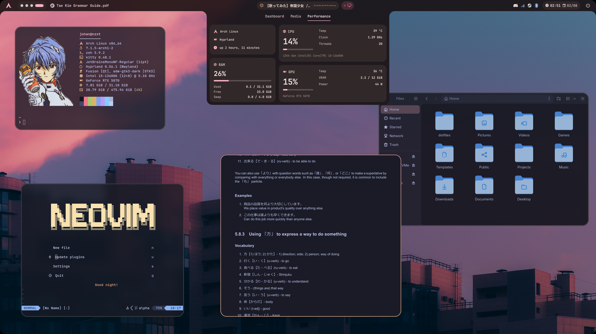
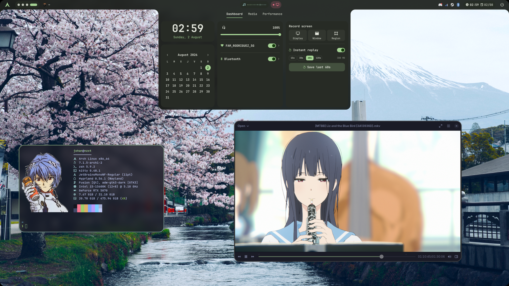
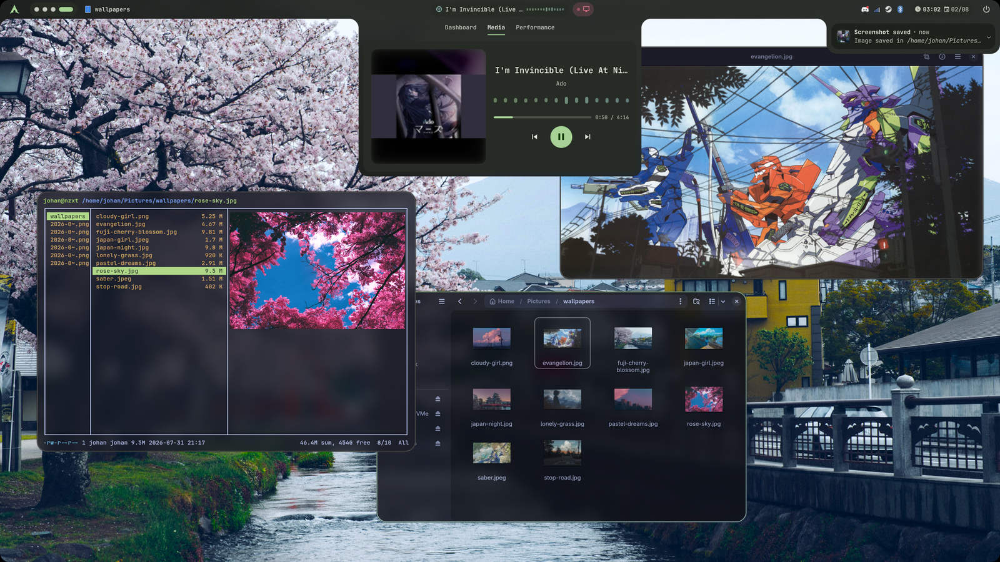

<p align="center">
    <h1 align="center">dotfiles</h1>
</p>

<p align="center">
    Arch Linux + Hyprland, with a Material You accent palette generated from the wallpaper.
</p>

<p align="center">
    
</p>

<p align="center">
    
    
</p>

<p align="center">
    <sub>Two palettes, one shell. Every colour above is generated from the image behind it.</sub>
</p>

---

| | |
|---|---|
| Compositor | Hyprland, configured in **Lua** (`hyprland.lua`, not `hyprland.conf`) |
| Terminal | kitty + zsh + starship |
| Shell | Quickshell — bar, dynamic island, launcher, notifications, power menu, settings window, keybind cheatsheet |
| Login | SDDM |
| Files | ranger · Nautilus |
| Images / video / PDF | Loupe · Celluloid · zathura |
| Color | matugen |
| Boot | GRUB + btrfs snapshots (snapper) |

The base palette is fixed (Tokyo Night) and matugen only supplies the
**accents**, so contrast never depends on which wallpaper happens to be set.

**Nothing in this repository is tied to one home directory.** There is no
absolute `/home/<user>` path in any tracked file, and the installer does not
rewrite one into your own — everything resolves `$HOME` or `%h` at runtime.
What *is* specific to one machine or one person lives outside git; see
[Per-machine configuration](#per-machine-configuration), which is the section
to read if you are cloning this for yourself.

---

## Install

```sh
git clone https://github.com/Johanx22x/dotfiles.git ~/dotfiles
cd ~/dotfiles
./install.sh
```

Six numbered steps plus a monitor check, each asking before it does anything,
so you can apply only the parts you want. It is idempotent — re-running it is
safe — and it refuses to run as root or on a non-Arch system. Most of what can
go wrong is reported and stepped over rather than fatal — a `yay` that will not
build, an AUR package that fails, no user session to enable the timer with, no
network for the Neovim clone, no wallpaper to build a palette from — because
none of it is worth losing the linking step over.

1. **Packages** from `packages/pacman.txt` (130 of them), plus `stow` itself.
   Anything your repos don't have is skipped and listed rather than aborting
   the whole transaction, which is what pacman does over a single missing
   name. `packages/multilib.txt` (Steam and the 32-bit libraries) is offered
   straight afterwards, and only if `[multilib]` is enabled in
   `/etc/pacman.conf` — the script prints the two lines to uncomment and moves
   on if it isn't, because enabling it means editing `/etc`.
2. **AUR** — builds `yay` if it is missing, then installs `packages/aur.txt`
   through it.
3. **Symlinks** the config with stow, then reloads the user systemd daemon and
   enables `wallpaper-rotate.timer` and `hyprpolkitagent.service`. stow plans
   the whole operation and aborts all of it on the first conflict, so a single
   pre-existing file means nothing gets linked — and there usually is one,
   because Hyprland writes a default config into `~/.config/hypr` the first
   time it runs. The conflicts are found up front with a dry run — all of them,
   and in each of the three wordings stow uses for one: a plain file in the
   way, a link stow does not own (another clone of this repo, a previous
   dotfiles manager), and a link stowed from a different package. You are
   offered to *move* them (never delete, never `--adopt`) into
   `~/dotfiles-replaced-<timestamp>`. Anything else stow objects to is not
   guessed at: it is printed as it came and the run stops there.
4. **Seeds** — copies `seeds/` into `$HOME`, but only where nothing is there
   yet. Never overwrites. See [Seeds, not symlinks](#seeds-not-symlinks).
5. **Neovim** — clones [its own repo](https://github.com/Johanx22x/nvim) into
   `~/.config/nvim`, and leaves it alone if that path already exists.
6. **Palette** — runs `wallpaper-switch random` so the generated colour files
   exist. Needs at least one image in `~/Pictures/wallpapers`; without one it
   says so instead of failing.

Then, unnumbered, a **monitor check**. It works from the hardware inwards: for
every screen Hyprland reports it says whether this machine has already recorded
it in `monitors.lua`, whether `hyprland.lua` names it, or neither. Only the
last case is a problem, and not a fatal one — the fallback rule still gives an
unlisted screen its preferred mode and an automatic position, it just does not
place it or pin a rate.

When there is one, it prints every attached monitor as the compositor sees it,
each with **the `hypr-monitor set` command that records it**, ready to run once
you have arranged the screens the way you want them. It changes nothing by
itself: which screen is main and where the others sit is a layout decision,
not something to infer from an EDID.

Left to do by hand, as the script says when it finishes:

1. `/etc` — see [the table below](#etc--applied-by-hand). **The fstab UUIDs
   belong to the original machine**; do not copy it as is.
2. The monitors, if the check listed one as not configured — with the
   `hypr-monitor set` line it printed, or from the settings window. Both write
   `monitors.lua`, which is generated and gitignored;
   [`hyprland.lua` is tracked and does not need editing](#per-machine-configuration).
3. The GPU driver.
4. `chsh -s /usr/bin/zsh`, if zsh is not already your shell.

**The GPU driver is deliberately not installed for you.** It is the one choice
that depends on hardware the repo cannot see, and guessing wrong is not free:
an NVIDIA DKMS module rebuilds on every kernel update, for a card that isn't
there. Install yours before or after. Where 32-bit drivers are concerned,
`steam` depends on the `lib32-vulkan-driver` and `lib32-libgl` virtual
packages, so pacman asks you to pick a provider itself.

---

## Layout

Every stow package is a top-level directory that mirrors the path it will have
relative to `$HOME`. So `stow hypr` creates
`~/.config/hypr/hyprland.lua -> ~/dotfiles/hypr/.config/hypr/hyprland.lua`.

These fourteen are the packages, and the list matches `PACKAGES=` in
`install.sh` exactly:

```
zsh/        .zshrc
hypr/       .config/hypr/            hyprland.lua + gaming.lua
quickshell/ .config/quickshell/      bar, island, launcher, notifications,
                                     power menu, cheatsheet, settings window
kitty/      .config/kitty/
matugen/    .config/matugen/         config.toml + 10 colour templates
shell/      .config/                 btop, starship (two profiles), cship
gtk/        .config/                 gtk-3.0 and gtk-4.0 settings.ini
media/      .config/mpv/             + a wireplumber rule for the capture card
openrgb/    .config/OpenRGB/
systemd/    .config/systemd/user/    wallpaper rotation + AirPods battery,
                                     each a service and a timer
bin/        .local/bin/              17 scripts
            .local/share/applications/  the capture-card desktop entry
ranger/     .config/ranger/          rc.conf, scope.sh, tokyonight colorscheme
icons/      .local/share/icons/      an icon that does not ship with its app
zen/        .zen/rice/               user.js + userChrome.css (Zen browser)
```

Four directories are **never stowed**:

```
packages/   package lists: core, multilib, AUR
system/     copies of /etc — reference only, applied by hand
seeds/      qt6ct.conf, mimeapps.list — COPIED once, not linked
assets/     the screenshots at the top of this file
```

`--no-folding` matters and the installer uses it: it links file by file
instead of linking whole directories. That keeps `~/.config/hypr` a real
directory, so matugen can write `colors.lua` into it without the generated
file landing inside the repo. The flip side is that a **new** file you create
under a stowed directory is not in the repo — move it into the package and
re-run `stow --no-folding -t ~ -d ~/dotfiles <package>`.

---

## Per-machine configuration

This repo is pulled by more than one machine, with different monitors and a
different keyboard. Anything that belongs to *one* of them is kept out of git
on purpose: a tracked personal file turns every pull on the other machine into
a conflict. `hyprland.lua` loads the pieces with `pcall(dofile, ...)`, so a
missing file is the normal case on a fresh clone and a broken one leaves the
tracked config standing instead of taking the desktop down.

| File | Written by | Holds |
|---|---|---|
| `~/.config/hypr/monitors.lua` | **generated** — `hypr-monitor`, called by the settings window | mode, position, scale and rotation per monitor |
| `~/.config/hypr/tweaks.lua` | **generated** — `hypr-tweak`, called by the settings window | gaps, corner rounding, border width, mouse, key repeat, cursor |
| `~/.config/systemd/user/wallpaper-rotate.timer.d/interval.conf` | **generated** — `wallpaper-interval` | how often the wallpaper rotates |
| `~/.config/hypr/local.lua` | **you**, by hand | keyboard layout, extra binds, window rules |

All three are in `.gitignore`. None is required. `tweaks.lua` is read **last**,
after everything tracked and before `local.lua`: a value set from the settings
window beats `hyprland.lua`, and a hand-written local file still beats both.

**`monitors.lua`** is a pure override layer: `hyprland.lua` declares the
monitors it was written for, and this file is `dofile`'d at the end of that
section, where a later `hl.monitor` for the same output replaces the earlier
one. Delete it and the tracked block stands on its own again. It is generated,
so do not edit it by hand — the script rewrites it whole:

```sh
hypr-monitor                       # show what is overridden
hypr-monitor set <desc> <mode> <position> <scale> <transform>
hypr-monitor forget <desc>         # drop one override
hypr-monitor clear                 # drop them all
```

`<desc>` is the monitor's EDID description **without** the `desc:` prefix.
Values are validated before anything is written, and the change is also pushed
into the running compositor with `hyprctl eval`, so it takes effect without a
reload. The Display page of the settings window drives exactly this script.

**`local.lua`** is loaded last, after every declaration in `hyprland.lua`, and
is the escape hatch for everything personal. What "override" means there is not
uniform, and the file's own comment spells it out: variables and `hl.monitor`
are replaced by the later call, `hl.window_rule` / `hl.layer_rule` edit in
place when the name matches, but **`hl.bind` does not replace** — it appends,
and both binds fire. To take a chord over, `hl.unbind("SUPER + W")` first.

### Seeds, not symlinks

Two files are **copied** rather than linked, and live in `seeds/`:
`~/.config/qt6ct/qt6ct.conf` and `~/.config/mimeapps.list`. The applications
that own them rewrite them — qt6ct rewrites its config in full on every save,
comments and all, and stores its own window geometry in there; `mimeapps.list`
is rewritten by anything that claims a default handler. Symlinked into the
repo, both left every machine with a permanently dirty working tree and a
collision on every `git pull`.

So the installer copies them once, only where nothing exists yet, and never
overwrites. From that moment they belong to the machine. They are not
decoration either: `qt6ct.conf` puts Qt on the Adwaita icon theme, without
which tray menus asking for icons by name come up as missing-icon
chequerboards. [`seeds/README.md`](seeds/README.md) has the rest, including how
to adopt a change to a seed on a machine that already has the file.

### Shared state under `~/.local/state`

Some settings are not the shell's alone. The desktop transparency is read by
Quickshell, kitty, Zen and Hyprland; the type size has to agree between the
shell and the terminal. Rather than four numbers in four configs, each one is a
single file that one script writes and everything else reads:

| File | Written by | Read by |
|---|---|---|
| `desktop-opacity` | `desktop-opacity` | Quickshell, `hyprland.lua`, kitty (`opacity.conf`), Zen (`opacity.css`) |
| `desktop-font` | `desktop-font` | Quickshell, kitty (`font.conf`) |
| `hypr-monitors` | `hypr-monitor` | `hypr-monitor` itself, to regenerate `monitors.lua` |
| `hypr-tweaks` | `hypr-tweak` | Quickshell, and `hypr-tweak` itself to regenerate `tweaks.lua` |
| `night-light` | `night-light` | Quickshell |
| `wallpaper-interval` | `wallpaper-interval` | Quickshell, and the script itself to regenerate the timer drop-in |
| `laptop-modules` | `laptop-modules`, called by `install.sh` | Quickshell |
| `airpods-battery` | `airpods-battery`, on a systemd timer | Quickshell |
| `wallpaper-dir` | `wallpaper-switch dir` | Quickshell, `wallpaper-switch` |

```sh
desktop-opacity          # print the current value
desktop-opacity 0.75     # set it (0.40 - 1.00)
desktop-font             # print size and family
desktop-font 12          # set the size (8 - 16)
hypr-tweak               # print every compositor value and its range
hypr-tweak set gaps-in 8 # gaps, rounding, border, mouse, key repeat, cursor
hypr-tweak reset border  # put one back to its default
hypr-tweak clear         # forget the lot, then `hyprctl reload`

night-light on           # blue light filter on
night-light temp 3200    # how warm (2500 - 6000 K)
night-light off

laptop-modules           # "on" or "off" for the battery and brightness widgets
laptop-modules on        # install.sh asks this; off unless answered

desktop-brightness       # the backlight percentage, or "none"
desktop-brightness set 60
desktop-brightness up 10

wallpaper-interval       # how often the wallpaper rotates, in minutes
wallpaper-interval 90    # every hour and a half (5 - 10080)
wallpaper-interval clear # back to the timer's own 30

airpods-battery show     # the charge in each bud and the case
default-apps             # print every role and its handler
default-apps candidates image
default-apps set image org.gnome.Loupe.desktop

desktop-avatar           # print the profile picture, or "none"
desktop-avatar pick      # choose one in a file dialog
desktop-avatar clear     # go back to the initial

wallpaper-switch dir             # print the collection's folder
wallpaper-switch dir pick        # choose it in a folder dialog
wallpaper-switch dir ~/Wallpapers
```

`desktop-avatar` is the odd one out of that list: it writes `~/.face` rather
than a state file, because `~/.face` is the freedesktop convention and a
display manager looks for the same picture. It scales anything larger than
512px down on the way in — a wallpaper picked as an avatar was a 12 MB file
being decoded by everything that reads it to draw a 38px circle.

The two dialogs are **GTK's, through zenity** (a declared dependency, since it
was previously only present because Steam pulls it in). Nothing here builds a
file browser: one already knows about thumbnails, recent places and filtering
by type, and it is themed by the same `gtk.css` matugen generates.

The shell's own preferences — 24-hour clock, date on the bar, notification
timeout — stay in Quickshell's `config.json` under
`~/.local/state/quickshell/`, because nothing outside the shell reads them.
`Config.qml` explains why the split is two stores and not one, and why the
settings window lives inside the shell process rather than beside it.

---

## The shell

Quickshell replaces waybar, wofi and dunst; `hyprland.lua` starts it with
`qs -d --no-duplicate`. It picks its monitor at runtime (`Screens.qml`:
`preferredModel` if set, else the only screen, else the largest landscape one)
instead of naming a model, so a clone on other hardware still comes up with a
bar. The rounded display corners are the exception and go on every monitor.

| Key | |
|---|---|
| `SUPER + /` | the cheatsheet — every bind that carries a description |
| `SUPER + SPACE` | launcher |
| `SUPER + V` | clipboard history |
| `SUPER + D` | dashboard (clock, calendar, volume, Wi-Fi, Bluetooth, recorder), with notifications, media and performance on its other tabs |
| `SUPER + C` | settings window |
| `SUPER + N` / `SUPER + SHIFT + N` | do not disturb / notification history |
| `SUPER + SHIFT + ESCAPE` | power menu |
| `SUPER + SHIFT + W` / `SUPER + SHIFT + A` | next / random wallpaper |
| `SUPER + S` | region screenshot to the clipboard |
| `ALT + Z` | save the last 30 seconds from the replay buffer |

The **settings window** (`SUPER + C`, or the gear on the bar) is an ordinary
window inside the shell process, not a second `qs` instance — the state path is
hashed per entry point, so two processes would write two files and read
neither. Its pages: User, Appearance, Wallpaper, Bar, Notifications, Display,
Sound, Input, Network, Bluetooth, Apps, Keybinds, About.

Three of those are worth knowing about before you go looking for a button that
isn't there. **Display** writes through `hypr-monitor`, so a change made there
is the same override you would have written by hand. **Keybinds** reads and
never writes: with a Lua config every bind reaches `hyprctl binds -j` as
`"dispatcher": "__lua"` with an opaque callback index, so the chord and the
description are knowable but what the bind *does* is not — and a generator
pointed at `hyprland.lua` would produce a correct list of binds while
destroying the prose that explains why they are those binds.

**Sound** talks to PipeWire directly through Quickshell's binding — no `wpctl`,
no `pactl`, nothing polled. It chooses the default output and input, sets the
volume of either, meters what is actually coming through them, and gives every
running application its own volume and mute alongside the device it is linked
to, so "what is listening to my microphone" is answerable in one place. Three
things are deliberately not there, because the binding does not expose them:
card profiles (a headset's stereo mode versus its microphone mode), port
selection, and moving a running application to another device. The last section
of the page says so and opens `pavucontrol`, which has all three. Balance is
absent for a different reason — `audio.volume` reads back as the *average* of
the channels, so a balance control and the volume percentage fight over one
number; the note at the top of `AudioPage.qml` has the measurements.

---

## Color

`wallpaper-switch` sets the wallpaper and runs matugen, which renders ten
files from the templates in `matugen/.config/matugen/templates/`:

```
~/.config/quickshell/colors.json   ~/.config/gtk-3.0/gtk.css
~/.config/kitty/colors.conf        ~/.config/gtk-4.0/gtk.css
~/.config/hypr/colors.lua          ~/.config/qt6ct/colors/matugen.conf
~/.config/zathura/zathurarc        ~/.config/ranger/accent
~/.config/fastfetch/config.jsonc   ~/.zen/rice/chrome/colors.css
```

**None of these are in the repo** — they change with every wallpaper. Edit the
template, then `wallpaper-switch reapply`. They all carry a
`GENERATED BY MATUGEN` header so you notice when you're in the wrong file.

```sh
wallpaper-switch next | prev | random | reapply
wallpaper-switch set /path/to/image.jpg
```

`zathurarc` and `fastfetch/config.jsonc` are generated *whole*, not just their
colours: neither application can include a separate colour file, so the
template is the entire configuration and neither has a stow package.

**ranger** is the odd one: it's curses, so it only understands indices into the
256-colour palette, not hex. matugen writes the two accents as decimal RGB and
the colorscheme converts them to indices in Python at startup. Everything else
inherits the 16 ANSI colours kitty already defines.

A systemd user timer (`wallpaper-rotate.timer`, enabled by the installer)
picks a new wallpaper every 30 minutes.

---

## `/etc` — applied by hand

`system/` holds reference copies. **Don't symlink them**: root shouldn't read
its configuration from a directory the user can write to.

| File | Goes to | Watch out |
|---|---|---|
| `mkinitcpio.conf` | `/etc/mkinitcpio.conf` | no `kms` hook; `MODULES=(nvidia …)` for early KMS |
| `linux.preset`, `linux-lts.preset` | `/etc/mkinitcpio.d/` | classic image, not a UKI |
| `modprobe-nvidia-gaming.conf` | `/etc/modprobe.d/nvidia-gaming.conf` | KMS, VRAM across suspend, PAT |
| `modules-load-ntsync.conf` | `/etc/modules-load.d/ntsync.conf` | Proton needs `/dev/ntsync` |
| `default-grub` | `/etc/default/grub` | `GRUB_TOP_LEVEL` pins `vmlinuz-linux` as the default entry |
| `fstab` | `/etc/fstab` | **the UUIDs belong to this machine** — regenerate them |
| `reflector.conf` | `/etc/xdg/reflector/reflector.conf` | mirrors, sorted by measured rate |
| `sddm-10-general.conf` | `/etc/sddm.conf.d/10-general.conf` | theme, cursor, numlock |
| `sddm-Xsetup` | `/usr/share/sddm/scripts/Xsetup` | rotates the vertical monitor at the login screen |

Then: `sudo mkinitcpio -P && sudo grub-mkconfig -o /boot/grub/grub.cfg`.

Two things that are easy to get wrong:

**`/boot` is a directory inside the `@` subvolume**, not the ESP — the ESP is
mounted at `/efi`. That is what puts the kernel and initramfs inside the
snapshots, which is what makes a rollback produce a coherent system.

**The SDDM greeter runs on Xorg**, which knows nothing about Hyprland's
`transform`. Without `Xsetup` the vertical monitor comes up sideways on the
login screen. It matches outputs by SIZE, not by name, because the names differ
between Xorg and Hyprland and change between boots — and it exits early unless
at least two outputs have a mode, so a single-monitor machine is never touched.

---

## What is *not* in the repo

**Neovim** — [its own repo](https://github.com/Johanx22x/nvim). Vendoring it
here would make it a submodule and complicate cloning.

**The wallpapers.** Not configuration, and git handles large binaries poorly.
Put your own in `~/Pictures/wallpapers`, or point the collection somewhere else
with `wallpaper-switch dir` — the launcher's picker and the settings window's
grid both read that one setting.

**`cship`** is a compiled binary, so only the binary is ignored; its
configuration *is* here, under `shell/`.

**`claude`** is a symlink into `~/.local/share/claude/`, which its own
installer manages and versions. Both it and `cship` sit in `~/.local/bin`
alongside the nine scripts that *are* tracked, and both are named in
`.gitignore` for the same reason as the generated files there: with
`--no-folding` that directory is real and nothing can leak into the repo
anyway, so the rules are the net for a stow run without it.

**Everything generated**: the matugen output above, `monitors.lua`,
kitty's `opacity.conf` and `font.conf`, Zen's `opacity.css`, and the
`*.target.wants` symlinks that `systemctl --user enable` creates — those point
at absolute paths and would dangle for another user, which is why the installer
recreates them instead.

**Application state and anything holding credentials.** No browser, Discord,
Steam or `gh` profile is tracked here.

---

## Hardware

Written on an i5-13600K, an RTX 5070 (Blackwell — `nvidia-open-dkms`) and
32 GB of RAM, with two monitors on the 5070: a 2560x1440@165 and a 1080p one
rotated to portrait.

Monitors are matched **by EDID description**, not by connector name: the kernel
reassigns names like `DP-3` and `HDMI-A-1` between kernel versions, and every
rule keyed on them silently stops applying.

The monitor block in `hyprland.lua` is the only part of the tracked config
that describes these particular screens, and you do not have to edit it —
`hypr-monitor` and the settings window override it from outside git (see
[Per-machine configuration](#per-machine-configuration)). Everything else works
itself out at runtime:

| | |
|---|---|
| Which screen the shell is on | `quickshell/Screens.qml` — largest landscape, with an override |
| Which GPU the shell reads | `quickshell/modules/island/SystemStats.qml` — whichever driver is bound in `/sys/class/drm`: `nvidia-smi` on a GeForce, amdgpu's sysfs files on a Radeon, and no GPU tile at all when neither answers |
| The replay buffer's monitor and mic | resolved live, never a connector name |
| gamescope's virtual output | read off the monitor you are on |
| The login screen's rotation | largest output wins, and a single-monitor machine is left alone |

`gaming-check` is a read-only health check for the gaming half of this setup —
multilib, the 32-bit libraries, the NVIDIA driver, `/dev/ntsync`, the boot
images. It changes nothing; run it with `sudo` if you want it to inspect the
initramfs too.
